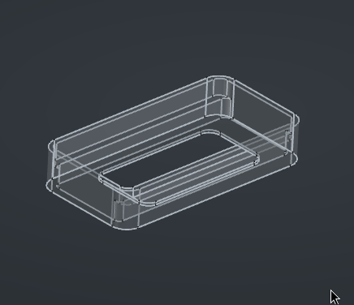
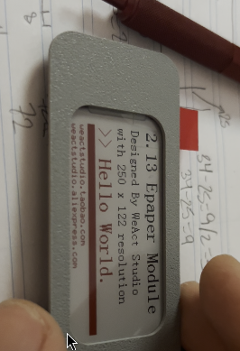
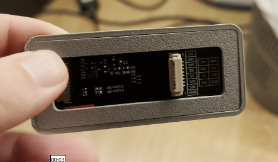

## background
for a while now, I've been wanting to have my own mp3 player in which I could play music offline and also knowing I own every single byte of the audio files I'm playing.
I think it might have to do a bit with actually listening to the music without algorithm blah blah AI mark zuckerberg and so on i just want my mp3 player okay and been wanting it for more than a year

## previous attempts
I don't have this documented but I did build an mp3 player in the past, I had a really shitty 3d printer which I didn't even bother using and built the project with an arduino and a [dfplayer](https://es.aliexpress.com/item/1005008692398110.html), this prototype just played mp3 files (i want .wav) and the furthest I got at the time was the pcb with play/pause and skip buttons iirc. it did work but it didn't satisfy me and honestly today's result also doesn't but its closer and I can actually walk out my apt with it without it looking too much like a bomb.

## the idea
while on a trip to [Lyon](https://en.wikipedia.org/wiki/Lyon), I quickly realized there were no LED signs with ads on the streets, and it was all extremely visually pleasant. they do have ads on the streets, but digital advertising as in LED signs are prohibited by law, so what they do have are [paper displays](https://www.jcdecaux.fr/annonceurs-agences/lancez-une-campagne-daffichage-dans-votre-ville/lyon), called **panneaux déroulants**.
i have to say this was inspiring to the design of the mp3 player, so when I was thinking of how I wanted it to look like, my brain quickly jumped to that trip and how "analogue" and nice it was to look at things that are supposed to be digital and slop like in an analogue format. i decided i wanted an e-ink display for my player 

## component list
- 2.13 e-ink display
- Xiao ESP32S3 (microcontroller)
- a DAC (digital audio codec)
- battery
- sd card reader
- switch and other disposables

# building
i want to preface this by saying its a prototype, with that said, the first thing I wanted to get done was designing the e-ink display case, which I whipped up in cad fairly fast

nicely enough it was a press fit so it was easy enough to build around it i basically knew i'd be able to glue it to whatever I designed afterwards and it'd look fine enough for a beta device.

that's from when I was testing the fit on the screen and how I wanted it to look like

okay so i built the holder for the screen, the backplate to keep it inside the case

after that I diverged onto many other projects for about two weeks which incidentally helped me get considerably better at CAD, at least to a level where i'd feel somewhat comfortable continuing the build, because at the time it all felt a bit daunting

having gained a bit more experience, I measured the components I had and came up with this thing to hold them, usually I need to print and test fit to lay out mentally what i want the thing to look like, at this point i was able to wire up the display to my esp32

