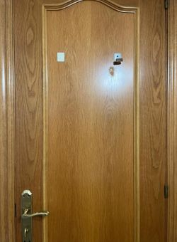
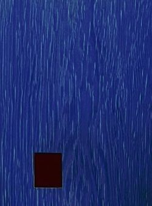
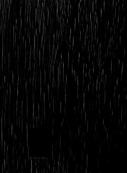

## BACKground
okay so hear me out, the other day I was taking a dump and while looking at my bathroom door, I wondered if I'd be able to store a file using the wood marks on it. it ended up being a really fun thought experiment.

## the concept
this is an idea I've been thinking about for a while, and has been resonating with me ever since I thought of it. for some reason I never did anything about it. I think it has something to do with the absurdity of it, and I don't even mean the decoding information from a bathroom door thing, but this whole concept in general.

the whole endeavour boils down to the fact that you can decode whatever you desire to produce your desired output, provided you have the right algorithm or mechanism to achieve that. metaphorically, and in a funny way, it's like the saying "make whatever you think of it". it's an analogue of overthinking a situation and convincing yourself (through your neuron algorithm) that the idea you made up in your mind about it is exactly what the situation actually is. 

I do think there might be something useful here, on the contrary to this more human example, given the mechanism that we build to decode this is transferable and has a sort of anchor in physical reality, as well as a source of semi-consistency. I say semi because as we will see or can probably deduce, it all depends on the way we capture our source, and the reliability of our consistency when capturing it (OR how we can correct for a relative lack of it, if our tools allow it).

## laying the foundational logs

that's my unassuming bathroom door that I was looking at when I had this idea, and by tweaking a lot of parameters on *[Krita](https://krita.org)*, an open source image editing app I barely know how to use, I managed to get a fairly high contrast image of the wood marks on a small section of the door:

*pretty bad,*

its safe to say I knew then and there it wasn't going to be as easy as I expected, but I had the small hope after some work all of this manual experimentation to resolve an image from which data could be decoded from, maybe would be streamlined.

by desaturating it to make it b&w, and using the "burn" filter, which I guess increases contrast, I managed to produce this afterwards:

it was still pretty bad, but there was a glimmer of hope that maybe I could make this work.

## babysteps
after a short window of thinking about what is it that I was doing, I came to the conclusion that for this to be reproducible, I had to come up with a way to replicate what [magic bytes](https://en.wikipedia.org/wiki/List_of_file_signatures) do on a file format. 

that is, implementing a mechanism, in the context of my bathroom door, that would allow a piece of code to understand where should it start reading data from, and for this, I would have to spend some time at my bathroom staring at the door, trying to see if I could spot some segment of it which would be easily identifiable by a piece of code sort of reliably.

the logical place to do this is the door frame, or the bevels that surround the wood mark pattern we're trying to read. this is fine, but for this whole idea to work, I'll have to decode the wood markings and structure them in a computer-readable format. if I'm going to be implementing that anyways, might as well decode the magic bytes from the same source.

this also brings a sort of redundancy to the accuracy and precision of the system, because the door frame might *and usually is* more noticeable than the wood markings, so by ensuring we read our "magic bytes" from these marks, we're also ensuring that the readability of the rest of the data is generally fine.

### thoughts and info:

- write in past tense and more formally
- probably a yt video demonstration of it working once it is
- an app

